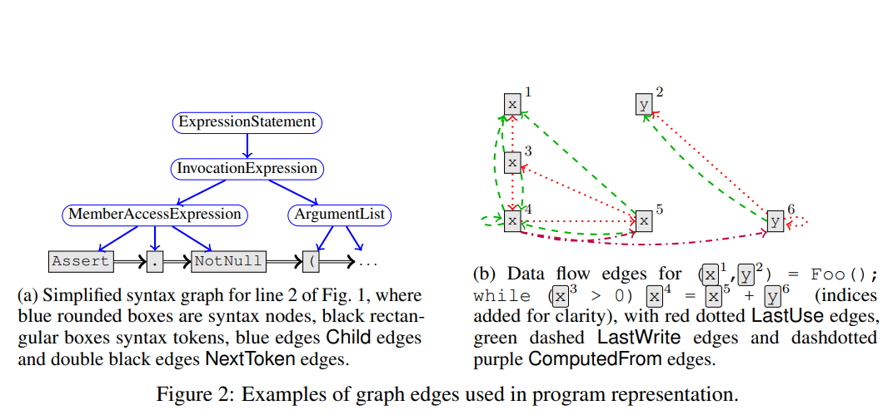
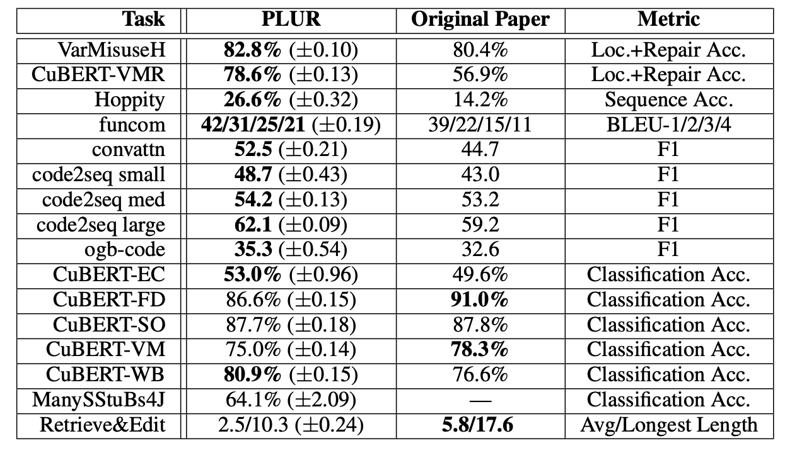

# Literature Review

# Table of Contents
- [Literature Review](#literature-review)
- [Table of Contents](#table-of-contents)
  - [Learning to Represent Programs with Graphs](#learning-to-represent-programs-with-graphs)
    - [Overview](#overview)
    - [Summary](#summary)
    - [Architecture](#architecture)
  - [Global Relational Models of Source Code](#global-relational-models-of-source-code)
    - [Overview](#overview-1)
    - [Overview](#overview-2)
    - [Summary](#summary-1)
  - [PLUR](#plur)
    - [Overview](#overview-3)
    - [Input and Output](#input-and-output)
    - [Model](#model)
    - [Pre-train Tasks (16 of them from different well-known paper)](#pre-train-tasks-16-of-them-from-different-well-known-paper)
    - [Summary](#summary-2)
  - [MODIT](#modit)
    - [Overview](#overview-4)
    - [Summary](#summary-3)

## Learning to Represent Programs with Graphs
https://arxiv.org/pdf/1711.00740.pdf

### Overview 
**model architecture:** GG-NN ([code](https://github.com/Microsoft/gated-graph-neural-network-samples))  
**data:** 2.9m LoC, 29 big projects  
**evaluation on tasks:**  
- new task proposed: VarMissuse, benchmarked agains BiRNN baseline  
- old task used VarName, benchmarked against previous models

**results:**  
- 32.9% accuracy on the VarNaming  
- 85.5% accuracy on the VarMisuse task  
- several real bugs in OSS projects were fixed

**constraints:** statically typed languages, C#  

### Summary
This is the most important paper for us, I think we can start by using this representation and combining with guidance. The important part for us is the graph representation (see sec 4. from the paper). They use a "program graph" with syntax, data-flow, and type information (see below from the paper).

They get the syntatic information from AST and combine it sematic information using the data and control flow. They also use 10 types of edges listed below:  
Child/NextToken  
- LastRead/LastWrite/ComputedFrom - variable edges, models control/data flows
- LastLexicalUse - shows repeated use of same variable
- GuardedBy/GuardedByNegation - enclosing guard expression for this variable
- FormalArgName — connects method call arguments to the name/type declaration
- ReturnsTo — links return tokens to name/type in method declaration

### Architecture
They use Gated Graph Neural Network from [here](https://arxiv.org/abs/1511.05493) but for us this isn't as important.

Input: graph  
Output: sequence  

## Global Relational Models of Source Code
https://openreview.net/pdf?id=B1lnbRNtwr

### Overview 
Attempting to bridge the gap between global, unstructured and local, structured models for program representation.  
### Overview 
**model architecture:** (2 models) - Graph Sandwiches, Graph Relational Embedding Attention Transformers(Great)  
**data:** 150k ETH Py150 dataset  
**evaluation on tasks:**  
- VarMissuse (from above paper)    
    - localization accuracy  
    - repair accuracy  

**results:**  
- Raise VarMisuse bug localization by 30%  
- Sandwich 82.5% on Class Accuracy < 250  
- GREAT 76.4% on Loc & Rep Accuracy < 250

### Summary
This paper uses the same graph input as above (Allamanis) but with edges between control-flow statements and function calls. They also consider a "leaves-only" graph, where edges for control/data flow are moved to the furthest leaf nodes that represent a given token. This allows the AST to be removed completely. We can consider a "full" graph vs "leaves-only" graph (see paper citation for abalation study on effectiveness of this).  

The other important part for us are the 2 models (sandwich and GREAT) which give ways for local information to be known in a global model, and global to be know in local model. We can do this by adding RNN/Transformer to GGNN, or creating a transformer with graph embedding as input.  
- Sandwich Models:   
    - "small" sandwiches:  
        - GGNN architecture and add a single RNN or Transformer  
    - "large" sandwiches:  
        - Wraps every message-passing block (see GGNN in paper or above) with a 128-dimensional (bi-directional) RNN/Transformer layer  
- GREAT: Uses the same architectural variations as the Transformer family (from the original transformer paper)  

## PLUR
https://openreview.net/forum?id=GEm4o9A6Jfb

###  Overview 
This paper proposed a unifying <strong>framework</strong> to generalized input and output and incorporate 16 well-known code training task into the framework such that the output can be used for many downstream tasks.
PLUR's model is encoder-decoder, where encoder is based on Transformer (however, they actually tried both vanilla Transformer and GGNN) and decoder is based on GraphToCoPo. Hence, the output will follow what GraphToCoPo suppose to provide: Token(can used for code classification), Copy(copy words from the sources code, can used for code summarization), Pointers(used to link the NL to code,  can used for code debugging)

### Input and Output
* Input: Graph with nodes and edges
  * Nodes:
    * Label: token value, such as name of variables
    * Type: Not ast node type, more abstract.
    * Position: a integer represent the ordering
  * Directed Edges:
    * source 
    * target
    * type: to represent the relationship between nodes
* Output:
  *  Token: a script to describe the tasks output in term of tokens
  *  Copy: is a mechanism to copy label from the input into the output (e.g. code summarization)
  *  Pointer: a linkage from above token to the input code

### Model
* Encoder: Transformers
* Decoder: Graph2ToCoPo

### Pre-train Tasks (16 of them from different well-known paper)

### Summary
Different training tasks proposed by different papers eventually require different input. This paper want to make uses of these training tasks by using PLUR unifying input and then approximate the structure of data representation and encoding from the original paper(to find why those input work for those task) and then trying to make in work for the PLUR input and PLUR encoder by extracting the the task-required input from PLUR input.

## MODIT
https://arxiv.org/pdf/2108.06645.pdf

### Overview 
**model architecture:** finetuned CodeBERT, GraphCodeBERT, CodeGPT. Train from scrath LSTM, transformer, CODIT
**data:** 2.9m LoC, 29 big projects  
**evaluation on tasks:**  
- B2Fs
- B2Fm

**results:**  
- MODIT accives 29.99% B2Fs accuracy
- multi modality improves performance

### Summary
Modality: (noun) a particular mode in which something exists or is experienced or expressed.  

This paper looks at the use of 3 modalities for learning to edit source code using a multi-modal NMT-based
tool. These modalities are information about edit location, edit context, and nl commit message:    
- Modality 1: Code to be edited  
- Modality 2: Guidance  
- Modality 3: Context  

Uses GumTree to extract sequence of tree edit locations, and identify from AST the subtree of that edit. It then uses a multi-layer encoder-decoder based model consisting of a Transformer-based encoder and a Transformer-based decoder.

